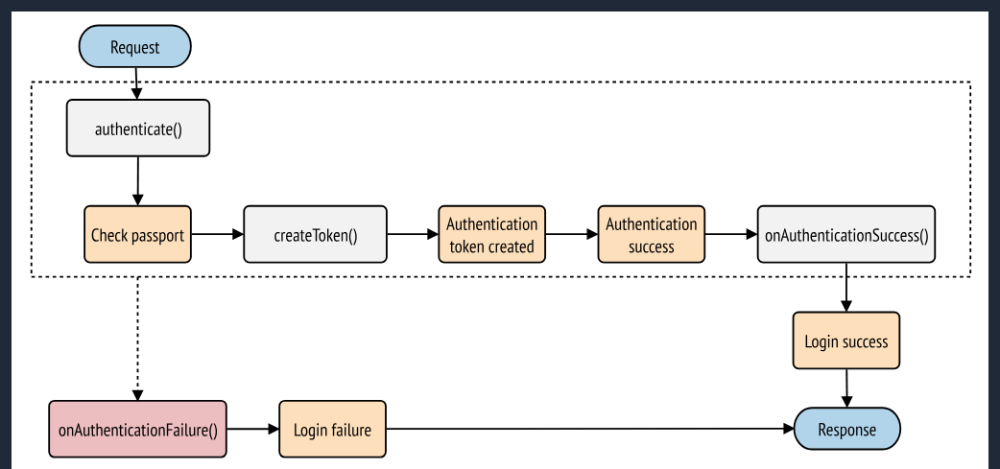

# bun-react-template

To install dependencies:

```bash
bun install
```

To start a development server:

```bash
bun dev
```

To run for production:

```bash
bun start
```

This project was created using `bun init` in bun v1.2.20. [Bun](https://bun.com) is a fast all-in-one JavaScript runtime.

lancer le conteneur docker 
docker exec -it hippo_univ_api-php-1 bash

php bin/console make:migration

php bin/console doctrine:migrations:migrate


